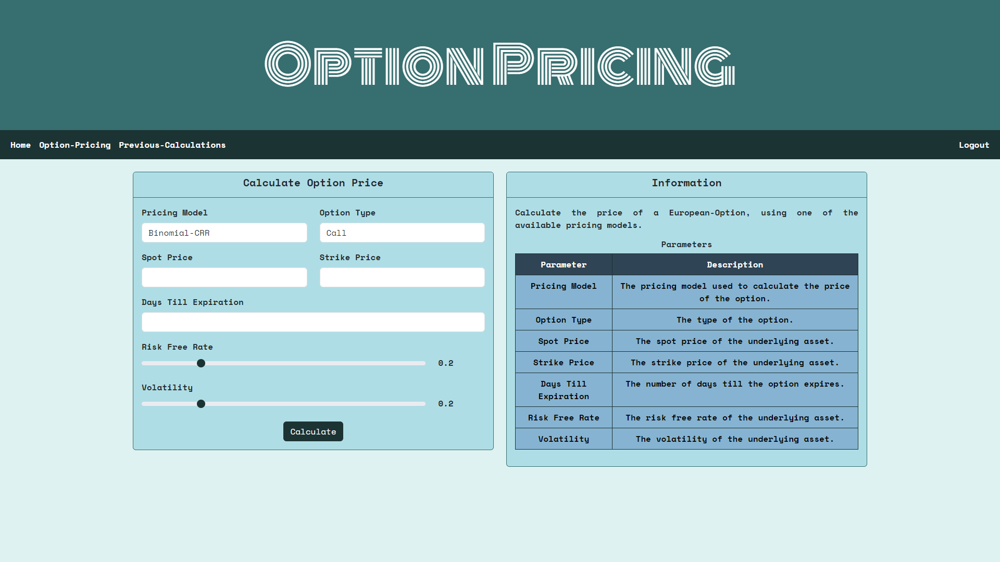

# Option Pricing
#### Video Demo : https://youtu.be/Jz42mZ7bgwg

## Contents
1. [Overview](#overview)
2. [Setup](#setup)
    + [Download Or Clone Repository](#download-or-clone-repository)
    + [Install Libraries](#install-libraries)
    + [Run Application](#run-application)
3. [Usage](#usage)
    + [Register](#register)
    + [Login](#login)
    + [Home](#home)
    + [Option-Pricing](#option-pricing)
    + [Previous-Calculations](#previous-calculations)
4. [Project Structure](#project-structure)
    + [Directories](#directories)
    + [Files](#files)
5. [Notes](#notes)
    + [Tech Stack](#tech-stack)
    + [Potential Improvements](#potential-improvements)
    + [References](#references)

## Overview
<p align="justify">
Welcome !
Option Pricing is a simple Python-Flask web application which can be used to calculate the price of a European-Option.
</p>

<p align="justify">
The application can be used to calculate the price of a European-Option, using one of the available pricing models.
As of now, the Binomial-CRR (Cox-Ross-Rubenstein), Black-Scholes and Monte-Carlo pricing models are available to use.
The application can also be used to get a quote of a stock, along with information about the stock and a time-series of closing-prices of the stock.
This feature is supported through the Alpha Vantage API (https://www.alphavantage.co/).
</p>

## Setup
<p align="justify">
The application is intended to be used as a web application.
However, since this is a personal project and will not be hosted on a server, the application must be run on a local machine.
The steps below can be followed to run the application on a local machine.
</p>

### Download Or Clone Repository
<p align="justify">
To begin with, this repository must be copied to the local machine.
This can be done through either downloading or cloning the repository.
To download the repository, use the "Download ZIP" button given in the "Code" dropdown on this GitHub page.
To clone the repository, use the following Git command in the terminal.
</p>

```
git clone https://github.com/Pavan365/CS50x-Final-Project.git
```

### Install Libraries
<p align="justify">
Next, the libraries required for the application must be installed.
The <b>requirements.txt</b> file contains all of the required libraries for the application.
These libraries can be installed using the following pip command in the terminal.
</p>

```
pip install -r requirements.txt
```

> [!NOTE]
> It is recommended to create a virtual environment before installing the required libraries.

### Run Application
<p align="justify">
To run the application, use the following command in the terminal.
This command will start a development server on port 5000 (default port), and the application can be accessed through the link provided in the terminal.
</p>

```
flask run
```

## Usage
<p align="justify">
This section provides an overview on the different pages in the application and how to use them.
</p>

### Register
<p align="justify">
The register page is used to create an account.
The username and password must meet all the requirements, otherwise the account will not be created and an error message is shown.
</p>

+ The register page.
<p align="center">
  
</p>

+ If registration is successful, the user will be redirected to the login page and a success message is shown.
<p align="center">
  
</p>

+ If registration is unsuccessful, an error message is shown.
<p align="center">
  
</p>

### Login
<p align="justify">
The login page is used to login to an account.
If the username or password is incorrect, an error message is shown.
</p>

+ The login page.
<p align="center">
  
</p>

+ If the username or password is incorrect, the following error message is shown.
<p align="center">
  
</p>

### Home
<p align="justify">
The home page can be used to get a quote of a stock, along with information about the stock and a time-series of closing-prices of the stock.
The data for the stock is retrieved using the Alpha Vantage API (https://www.alphavantage.co/).
If an invalid stock ticker is entered or an API error occurs, an error message is shown.
</p>

+ The home page.
<p align="center">
  
</p>

+ If a valid stock ticker was entered and the information for that stock was retrieved, the page will look like the following.
<p align="center">
  
</p>

+ If an invalid stock ticker was entered or an API error occurs, an error message is shown.
<p align="center">
  
</p>

### Option-Pricing
<p align="justify">
The option-pricing page can be used to calculate the price of a European-Option, using one of the available pricing models.
As of now, the Binomial-CRR (Cox-Ross-Rubenstein), Black-Scholes and Monte-Carlo pricing models are available to use.
To calculate the price of an option, the form must be filled out and submitted.
</p>

+ The option-pricing page.
<p align="center">
  
</p>

+ If a valid form is submitted, the price of the option is calculated and shown.
<p align="center">
  
</p>

### Previous-Calculations
<p align="justify">
The previous-calculations page shows the user's 10 most recent calculated option prices.
</p>

+ The previous-calculations page.
<p align="center">
  
</p>

+ If the user has no previous calculations, the page will look like the following.
<p align="center">
  
</p>

### Logout
<p align="justify">
To logout of an account, the "Logout" button on the navigation bar can be clicked.
</p>

<p align="center">
  
</p>

## Project Structure

### Directories
#### Path : root
+ ```app``` : Contains the files and directories for the Flask application.
+ ```flask_session``` : Contains the session files.
+ ```instance``` : Contains the database for the current instance of the application.
+ ```screenshots``` : Contains screenshots for the README file.

#### Path : root/app
+ ```option_pricing``` : A Python package which contains modules that define classes to represent option pricing models.
+ ```static``` : Contains the static files for the Flask application, such as CSS and JavaScript files.
+ ```templates``` : Contains the template files for the Flask application, which are HTML files.

#### Path : root/app/static
+ ```options``` : Contains the static files for the options blueprint of the Flask application.

#### Path : root/app/templates
+ ```authenticate``` : Contains the template files for the authenticate blueprint of the Flask application.
+ ```options``` : Contains the template files for the options blueprint of the Flask application.

### Files
#### Path : root
+ ```README.md``` : The README file for the project.
+ ```requirements.txt``` : Contains the required libraries for the application.

#### Path : root/app
+ ```__init__.py``` : Defines this directory as a Python package, this file configures the Flask application.
+ ```authenticate.py``` : Contains the routes for the authenticate blueprint of the Flask application.
+ ```database.py``` : A Python script which contains database related functions.
+ ```options.py``` : Contains the routes for the options blueprint of the Flask application.
+ ```schema.sql``` : Contains the schema of the database.
+ ```stock_services.py``` : A Python script which contains functions related to retrieving information about a stock, using the Alpha Vantage API.

#### Path : root/app/option_pricing
+ ```__init__.py``` : Defines this directory as a Python package.
+ ```binomial.py``` : Contains the class which represents the Binomial-CRR option pricing model.
+ ```black_scholes.py``` : Contains the class which represents the Black-Scholes option pricing model.
+ ```monte_carlo.py``` : Contains the class which represents the Monte-Carlo option pricing model.

#### Path : root/app/static
+ ```default.css``` : Contains the CSS for the Flask application.

#### Path : root/app/static/options
+ ```index.js``` : A JavaScript file which contains functions for the home page.
+ ```pricing.js``` : A JavaScript file which contains functions for the pricing page.

#### Path : root/app/templates
+ ```base.html``` : A HTML file which defines a base template.

#### Path : root/app/templates/authenticate
+ ```login.html``` : Contains the HTML for the login page.
+ ```register.html``` : Contains the HTML for the register page.

#### Path : root/app/templates/options
+ ```calculations.html``` : Contains the HTML for the calculations page.
+ ```index.html``` : Contains the HTML for the home page.
+ ```pricing.html``` : Contains the HTML for the pricing page.

## Notes

### Tech Stack
#### Back End
+ Python

#### Database
+ SQLite3

#### Front End
+ HTML
+ CSS
+ JavaScript

#### Frameworks & Libraries
+ Flask
+ Flask-Session
+ Flask-WTF
+ NumPy
+ Requests
+ SciPy
+ Werkzeug
+ WTForms

- Chart.js

+ Bootstrap

### Potential Improvements
+ Allow users to customise the pricing models, such as selecting the number of simulations used in the Monte-Carlo pricing model.
+ Implement more option pricing models.
+ Implement more finance/quantitative-finance related tools and features.
+ Improve the user interface and user experience.

### References
+ What is an Option ? : https://www.investopedia.com/terms/o/option.asp
+ Alpha Vantage API : https://www.alphavantage.co/
